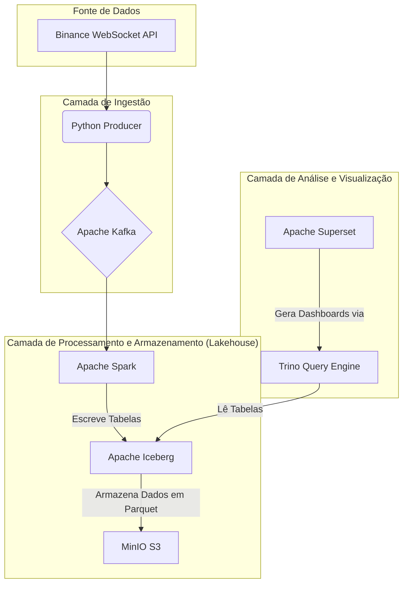

# Real-Time Data Lakehouse on Kubernetes

Lakehouse com ferramentas open source baseado em um projeto real implementado em um cliente. A infraestrutura é totalmente orquestrada com Kubernetes (Minikube para desenvolvimento local).


## 🏛️ Arquitetura

O projeto implementa uma arquitetura de Data Lakehouse moderna, onde os dados fluem através de camadas especializadas, desde a ingestão até a visualização.



O fluxo consiste em um **Producer** que captura dados em tempo real e os publica no **Kafka**. O **Spark** consome esses dados em streaming, os processa e os grava em tabelas no formato **Iceberg**, com os arquivos físicos (Parquet) armazenados no **MinIO**. O **Trino** atua como um motor de consulta rápido sobre essas tabelas, e o **Superset** se conecta ao Trino para criar dashboards e análises.

## 📁 Estrutura do Projeto

A organização dos arquivos segue um padrão focado em componentes, separando o código das aplicações (`apps`) da configuração da infraestrutura (`kubernetes`).

```bash
/k8s-lakehouse-pipeline/
│
├── .gitignore
├── README.md
│
├── apps/                    # Nosso código customizado que gera imagens Docker
│   ├── producer/
│   │   ├── main.py
│   │   └── Dockerfile
│   └── spark-processor/
│       ├── processor.py
│       └── Dockerfile
│
└── kubernetes/              # Todos os nossos arquivos de configuração do K8s
    ├── 00-namespace.yaml
    ├── minio/
    │   ├── deployment.yaml
    │   └── service.yaml
    ├── kafka/
    │   └── kafka-helm-values.yaml
    ├── spark/
    │   └── ...
    ├── trino/
    │   └── trino-helm-values.yaml
    └── superset/
        └── superset-helm-values.yaml
```

## 🚀 Como Executar (Ambiente Local com Minikube)

Siga os passos abaixo para iniciar o pipeline completo na sua máquina.

### Pré-requisitos
* VirtualBox (ou outro hypervisor compatível)
* Minikube
* `kubectl`
* Helm

### Passos de Configuração

1.  **Clonar o Repositório:**
    ```bash
    git clone [https://github.com/BrenoLD94/k8s-lakehouse-pipeline.git](https://github.com/BrenoLD94/k8s-lakehouse-pipeline.git)
    cd k8s-lakehouse-pipeline
    ```

2.  **Iniciar o Minikube:**
    É crucial alocar recursos suficientes para o cluster.
    ```bash
    minikube start --memory=8192 --cpus=4
    ```

3.  **Construir e Disponibilizar as Imagens Docker:**
    O Minikube roda em sua própria VM, então ele não enxerga as imagens Docker do seu sistema. Precisamos "enviar" nossas imagens customizadas para dentro dele.
    ```bash
    # Aponta seu terminal Docker para o ambiente do Minikube
    eval $(minikube -p minikube docker-env)

    # Constrói a imagem do producer (exemplo)
    docker build -t producer:latest ./apps/producer

    # Constrói a imagem do spark-processor (exemplo)
    docker build -t spark-processor:latest ./apps/spark-processor
    ```

4.  **Aplicar os Manifestos Kubernetes:**
    Aplique os arquivos de configuração na ordem correta para criar os serviços no cluster.
    ```bash
    # Criar o namespace dedicado
    kubectl apply -f kubernetes/00-namespace.yaml

    # Deployar o MinIO
    kubectl apply -f kubernetes/minio/

    # Deployar o Kafka (usando Helm)
    helm install kafka bitnami/kafka -f kubernetes/kafka/kafka-helm-values.yaml -n lakehouse

    # ... e assim por diante para os outros serviços
    ```

5.  **Verificar os Serviços:**
    Para checar se todos os "pods" (nossos contêineres) estão rodando:
    ```bash
    kubectl get pods -n lakehouse
    ```
    Espere até que todos estejam com o status `Running`.

6.  **Acessar as UIs:**
    Use o comando `minikube service` para criar um túnel e expor a UI de um serviço no seu navegador.
    ```bash
    # Exemplo para acessar a UI do Superset
    minikube service superset -n lakehouse
    ```

## 🤝 Como Contribuir

Este projeto segue um fluxo de trabalho estruturado para garantir a qualidade do código. Todas as contribuições são bem-vindas.

Para detalhes sobre nosso fluxo com Git Flow, padrões de commit e outras diretrizes, por favor, consulte o nosso **[Guia de Contribuição](CONTRIBUTING.md)**.